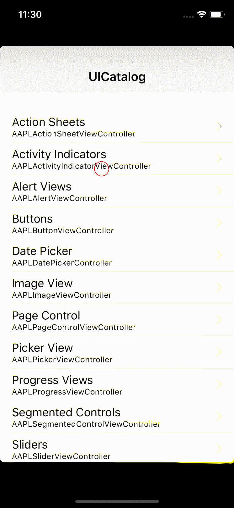

# 简介
使用Appium框架二次开发iOS端Monkey测试工具

目前支持功能:

1.基于随机事件:点击、滑动、输入、xpath定位、返回、重启app等事件,根据随机概率随机触发

2.支持多设备并发,替换appium端口和wda端口即可

3.支持testcase,需要在yaml文件中配置测试用例

4.支持步骤截图并生成gif图片

5.支持log打印

6.支持appium server自启动

7.支持守护线程

8.支持崩溃查询并且邮件发送

9.支持生成性能文件

# 项目打包
```aidl
根目录下: mvn install
在target目录下生成jar包
```

# 运行命令
```shell
cd /target 目录下 

参数说明:
-f: config文件配置地址
-c: 测试用例地址

config文件中配置数据:

UDID: "606EC265-1ED8-454D-AF80-BEB78A417B55" #设备udid
BUNDLEID: "com.iOS.Demo"  #app的bundle id
TIMING: "1" #运行时间,单位分钟
PORT: "3460" #appium端口
PROXYPORT: "5680" #WDA端口
NeedScreenshot: "true" #是否截图, true是截图
ScreenshotFolder: "～/iOSMonkey" #截图目录
VERBOSE: "true" # 打印日志
TRACEPATH: "～/iOSMonkey" # 性能文件路径
AppiumLogFolder: "～/iOSMonkey" # appiumlog文件路径

java -jar iOSMonkey-1.0.jar -f ~/config.yaml -c 1

在APP setCapability 添加 wdaLocalPort 8101 8102 
默认的webDriverAgent监听的端口是8000,不冲突就可以并发了
```

# 生成运行步骤gif图
 
安装ffmpeg brew install ffmpeg
 



# config配置文件
在代码中config目录下config.yaml
     
# 测试app
在代码中app目录下有测试app,可以根据配置config.yaml运行     
           
# 如何生产性能文件
参考: https://appiumpro.com/editions/12           
           
                                            
# 相关问题

1.iOS9.0版本不能xcuitest,需要iOS9.3

2.查看模拟崩溃日志路径<br>
~/Library/Logs/DiagnosticReports


```

